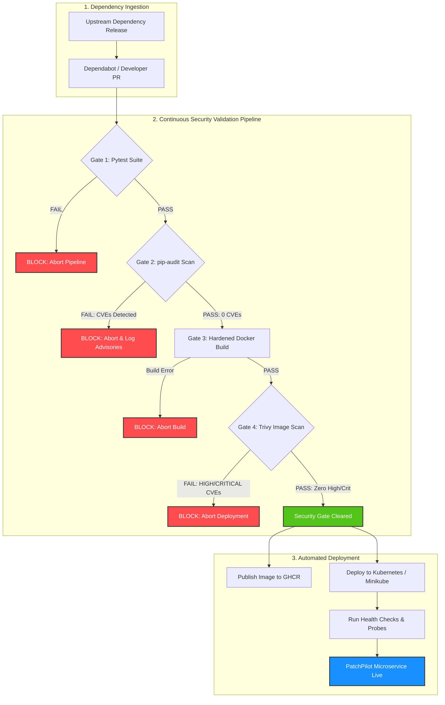

# PatchPilot: Automated DevSecOps Pipeline & Continuous Security Gate

PatchPilot is an automated DevSecOps platform and continuous deployment pipeline designed to safely validate, build, scan, and deploy dependency and application updates. It implements strict security gates that automatically deploy safe, tested updates to Kubernetes while intercepting and blocking unsafe changes containing known vulnerabilities.

---

## 1. Problem Statement
Modern cloud-native applications rely heavily on open-source dependencies and third-party packages. While keeping dependencies updated is essential for bug fixes and patches, automated dependency updates (e.g., automated merge bots) pose significant risks:
- **Supply Chain Attacks**: Compromised upstream dependencies or malicious package takeovers.
- **Transitive Vulnerabilities**: Introducing nested libraries with critical CVEs without developer awareness.
- **Breaking Changes**: Updates that introduce regressions or broken runtime behaviors.
- **Production Outages**: Deploying unvetted updates directly to container orchestration platforms.

PatchPilot addresses these challenges by embedding automated security validation directly into the continuous integration and delivery lifecycle.

---

## 2. DevSecOps Architecture & Workflow



---

## 3. Technology Stack & Tool Roles

| Tool | Category | Role in PatchPilot |
| :--- | :--- | :--- |
| **Python 3.13** | Runtime | Core execution environment for the microservice. |
| **FastAPI & Uvicorn** | Application Framework | High-performance, lightweight asynchronous REST microservice with health probes. |
| **Pytest & HTTPX** | Testing | Automated test suite validating status codes, schemas, and endpoint responses. |
| **pip-audit** | Software Supply Chain Security | Scans Python dependencies against the Python Packaging Advisory Database (PyPA) for known CVEs. |
| **Docker** | Containerization | Multi-stage, non-root Alpine container packaging with zero build-tool bloat. |
| **Trivy** | Container Security | Deep vulnerability scanner detecting OS-level and language package vulnerabilities in container images. |
| **Dependabot** | Automated Dependency Tracking | Actively monitors PyPI packages and generates automated Pull Requests for new versions. |
| **GitHub Actions** | CI/CD Automation | Orchestrates multi-stage security pipelines on pull requests and pushes. |
| **GitHub Container Registry (GHCR)** | Artifact Registry | Secure container image registry for hosting validated, signed container images. |
| **Kubernetes & Minikube** | Container Orchestration | Local declarative orchestration cluster managing deployments, health probes, and services. |
| **kubectl** | Cluster CLI | Declarative manifest deployment and cluster inspection. |

---

## 4. Project Directory Structure

```
PatchPilot/
├── app/
│   ├── __init__.py           # Package marker
│   └── main.py               # FastAPI application with / and /health endpoints
├── tests/
│   ├── __init__.py           # Test suite marker
│   └── test_main.py          # Pytest unit tests for all endpoints
├── k8s/
│   ├── deployment.yaml       # Kubernetes Deployment (probes, non-root security context)
│   └── service.yaml          # Kubernetes NodePort Service
├── scripts/
│   ├── run_pipeline.ps1      # End-to-end local DevSecOps pipeline runner
│   ├── demo_safe_update.ps1  # Demonstration of validated safe update deployment
│   └── demo_blocked_update.ps1 # Demonstration of blocked unsafe dependency update
├── .github/
│   ├── workflows/
│   │   ├── ci.yml            # Full CI pipeline: Tests, pip-audit, Docker build, Trivy scan, GHCR publish
│   │   └── deploy.yml        # Kubernetes dry-run manifest validation workflow
│   └── dependabot.yml        # Daily pip dependency update configuration
├── .vscode/
│   └── settings.json         # Workspace interpreter, test discovery, and lint configuration
├── .dockerignore             # Excludes development files, caches, and manifests from Docker context
├── .gitignore                # Excludes virtualenvs, bytecode, and scan reports from Git
├── Dockerfile                # Hardened multi-stage Alpine Dockerfile with unprivileged user
├── requirements.txt          # Production application dependencies
├── requirements-dev.txt      # Development, test, and security audit dependencies
└── README.md                 # Complete system documentation
```

---

## 5. Security Gate Policy

PatchPilot enforces a **Zero-Tolerance Security Gate** before any build artifact is eligible for deployment:

1. **Gate 1 — Unit & Functional Tests**:
   - Condition: 100% test cases in Pytest must pass.
   - Action on Failure: Immediate build termination.
2. **Gate 2 — Dependency Vulnerability Audit (`pip-audit`)**:
   - Condition: 0 known vulnerabilities allowed in production or development dependencies.
   - Action on Failure: Immediate build termination with logged CVE identifiers and remediation versions.
3. **Gate 3 — Hardened Container Build**:
   - Condition: Image must build cleanly using an unprivileged non-root user (`appuser`, UID 10001) without package managers (`pip`) in the final runtime layer.
   - Action on Failure: Build aborts.
4. **Gate 4 — Container Image Vulnerability Scan (`Trivy`)**:
   - Condition: `0 HIGH` and `0 CRITICAL` severity vulnerabilities permitted (`--severity HIGH,CRITICAL --exit-code 1`).
   - Action on Failure: Deployment BLOCKED. Image is never published to registry or deployed to cluster.

---

## 6. Local Setup & Usage Guide

### Prerequisites
- Windows 10/11 with PowerShell
- Git, Python 3.13+, Docker Desktop, Minikube, kubectl, Trivy

### Step 1: Environment Initialization
Clone repository and initialize a virtual environment:
```powershell
python -m venv .venv
.\.venv\Scripts\Activate.ps1
pip install --upgrade pip
pip install -r requirements-dev.txt
```

### Step 2: Run Application Locally
Start the FastAPI application using Uvicorn:
```powershell
uvicorn app.main:app --host 127.0.0.1 --port 8000 --reload
```
Test endpoints:
- `http://127.0.0.1:8000/`
- `http://127.0.0.1:8000/health`

### Step 3: Run Automated Tests
Execute the Pytest suite:
```powershell
.\.venv\Scripts\pytest -v
```

### Step 4: Run Dependency Security Audit
Audit dependencies for known CVEs:
```powershell
.\.venv\Scripts\pip-audit.exe -r requirements.txt
.\.venv\Scripts\pip-audit.exe -r requirements-dev.txt
```

### Step 5: Build Hardened Docker Image
Build the container image using the multi-stage Dockerfile:
```powershell
docker build -t patchpilot:local .
```

### Step 6: Scan Docker Image with Trivy
Run the Trivy container image vulnerability scan:
```powershell
trivy image --severity HIGH,CRITICAL --exit-code 1 patchpilot:local
```

### Step 7: Start Minikube & Deploy
Start Minikube using the Docker driver:
```powershell
minikube start --driver=docker --kubernetes-version=v1.31.0
```
Load the local Docker image into the Minikube cluster:
```powershell
minikube image load patchpilot:local
```
Apply the Kubernetes manifests:
```powershell
kubectl apply -f k8s/
```
Verify cluster resources:
```powershell
kubectl get deployments
kubectl get pods
kubectl get services
```
Expose and test the service:
```powershell
minikube service patchpilot-service --url
```

---

## 7. Automated Demonstrations

### Safe Update Flow (Automatic Deployment)
Simulates an authorized application update that passes tests, passes security audits, builds securely, and rolls out to Kubernetes:
```powershell
powershell -ExecutionPolicy Bypass -File .\scripts\demo_safe_update.ps1
```
**Expected Result**:
- Pytest: PASS
- pip-audit: PASS (0 CVEs)
- Docker Build: PASS
- Trivy: PASS (0 High/Critical)
- Kubernetes: **Deployment updated successfully**.

### Blocked Unsafe Update Flow (Security Gate Interception)
Simulates an incoming pull request introducing a vulnerable package (`urllib3 1.26.4` containing known vulnerabilities):
```powershell
powershell -ExecutionPolicy Bypass -File .\scripts\demo_blocked_update.ps1
```
**Expected Result**:
- Pytest: PASS
- pip-audit: **FAIL (Found known vulnerabilities: PYSEC-2021-108, PYSEC-2026-1995, etc.)**
- Pipeline status: **Deployment BLOCKED immediately**.
- Kubernetes cluster: **Zero unauthorized modifications made**.

---

## 8. GitHub Actions CI/CD Pipeline

The GitHub Actions workflow (`.github/workflows/ci.yml`) triggers on every push and pull request to `main`:
1. **Job 1: Tests & Dependency Security** (`test-and-audit`):
   - Sets up Python 3.13.
   - Executes Pytest test suite.
   - Runs `pip-audit` against both production and dev requirements.
2. **Job 2: Container Build & Trivy Scan** (`container-security`):
   - Sets up Docker Buildx.
   - Builds local test image.
   - Scans image with Aqua Security's Trivy Action (`aquasecurity/trivy-action@0.29.0`).
   - Hard fails (`exit-code: 1`) if any HIGH or CRITICAL vulnerabilities are discovered.
3. **Job 3: GHCR Image Publishing** (`publish-ghcr`):
   - Requires Jobs 1 & 2 to succeed.
   - Automatically authenticates to `ghcr.io` via `secrets.GITHUB_TOKEN`.
   - Tags and publishes `ghcr.io/<repo>/patchpilot:latest` and `:sha`.

---

## 9. Troubleshooting & FAQ

- **Minikube connection issue on Windows**:
  Ensure Docker Desktop is running. Start Minikube with `--driver=docker --kubernetes-version=v1.31.0`.
- **NodePort service not reachable directly via localhost**:
  With the Docker driver on Windows, Kubernetes NodePort ports are mapped inside the container network. Run `minikube service patchpilot-service --url` to create a direct bridge.
- **pip-audit warning about virtual environment path**:
  This is a harmless cosmetic notice emitted when pip-audit creates temporary inspection sandboxes. The tool functions normally.

---

## 10. Limitations & Future Work
- **Runtime Intrusion Detection**: Future work can incorporate Falco for runtime kernel anomaly detection in Kubernetes.
- **Admission Controllers**: Integrate OPA Gatekeeper or Kyverno to enforce security policies directly inside the Kubernetes API server.
- **Automated Pull Request Comments**: Post Trivy and pip-audit markdown reports directly into GitHub Pull Request threads.
